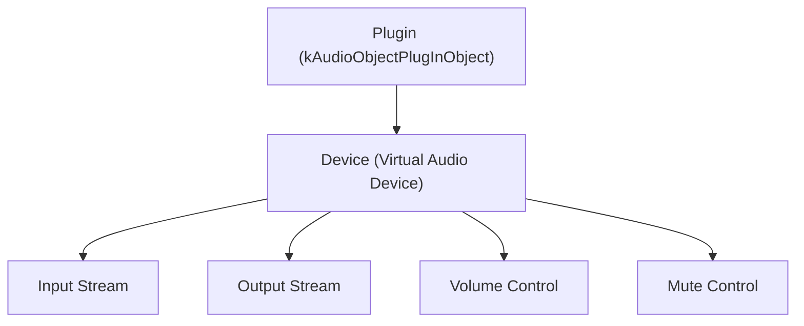
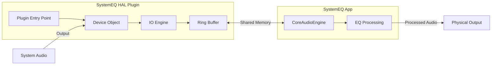

# HAL Plugin — Технічна специфікація

> Документ описує архітектурний план переходу від BlackHole  
> до власного HAL (Hardware Abstraction Layer) аудіо-плагіна.

## Мотивація

SystemEQ покладається на сторонній віртуальний аудіо-драйвер **BlackHole** для маршрутизації системного звуку. Це створює:

- **Крихкість**: BlackHole може зламатися при оновленні macOS
- **Складність для користувача**: потрібна ручна інсталяція та налаштування
- **Відсутність контролю**: неможливо впливати на баги чи зміни в BlackHole

Власний HAL plugin усуне ці залежності повністю.

---

## AudioServerPlugin API

Apple надає `AudioServerPlugIn` API (CoreAudio HAL), який дозволяє створювати **віртуальні аудіо-пристрої** на рівні системи.

### Ключові компоненти

| Компонент | Опис |
|---|---|
| `AudioServerPlugInDriverInterface` | C-struct з function pointers для всіх операцій |
| `AudioObjectID` | Унікальний ідентифікатор кожного об'єкта (пристрій, потік, контроль) |
| `AudioObjectPropertyAddress` | Адреса властивості (selector + scope + element) |

### Ієрархія об'єктів



### Обов'язкові callbacks

```c
// Основні функції, які повинен реалізувати плагін
OSStatus (*Initialize)(AudioServerPlugInDriverRef driver);
OSStatus (*CreateDevice)(AudioServerPlugInDriverRef driver, 
                         CFDictionaryRef desc,
                         const AudioServerPlugInClientInfo* clientInfo,
                         AudioObjectID* outDeviceID);
OSStatus (*GetPropertyData)(AudioServerPlugInDriverRef driver, 
                            AudioObjectID objectID,
                            const AudioObjectPropertyAddress* address,
                            ...);
OSStatus (*SetPropertyData)(...);
OSStatus (*StartIO)(AudioServerPlugInDriverRef driver, AudioObjectID deviceID);
OSStatus (*StopIO)(...);
OSStatus (*GetZeroTimeStamp)(...);
OSStatus (*WillDoIOOperation)(...);
OSStatus (*BeginIOOperation)(...);
OSStatus (*DoIOOperation)(...);
OSStatus (*EndIOOperation)(...);
```

---

## Вимоги

### Обов'язкові

1. **Apple Developer Account** — для code signing `.driver` bundle
2. **Code Signing** — обов'язково для macOS 10.15+
3. **Notarization** — рекомендовано для macOS 10.15+, обов'язково для macOS 14+
4. **Info.plist** — повинен містити `AudioServerPlugIn_BundleName`
5. **Розташування**: `/Library/Audio/Plug-Ins/HAL/` (system-wide)

### Технічні

- **Мова**: C++ (API є C-based, Swift не підходить для HAL плагінів)
- **Формат**: `.driver` bundle
- **Thread Safety**: всі callbacks можуть викликатися з будь-якого потоку
- **Real-time**: `DoIOOperation` працює в real-time потоці (без алокацій, без блокувань)
- **Підтримувані формати**: Float32, non-interleaved, 2 канали, 44100/48000/96000 Hz

---

## Архітектура плагіна



### Комунікація App ↔ Plugin

| Метод | Плюси | Мінуси |
|---|---|---|
| **Shared Memory (mach_vm)** | Найшвидший, zero-copy | Складний в реалізації |
| **XPC Service** | Безпечний, стандартний Apple API | Затримка ~0.1ms |
| **AudioServerPlugin custom properties** | Інтегрований в HAL | Обмежений API |

**Рекомендація**: Shared Memory для аудіо-даних + Custom Properties для керування.

---

## Етапи реалізації

### Phase 1: Прототип (2-3 тижні)
- [ ] Створити базовий `.driver` bundle з мінімальним HAL plugin
- [ ] Реалізувати віртуальний пристрій (2ch, 48kHz, Float32)
- [ ] Перевірити видимість у System Preferences → Sound

### Phase 2: Інтеграція (2-3 тижні)
- [ ] Реалізувати shared memory ring buffer
- [ ] Підключити SystemEQ до плагіна замість BlackHole
- [ ] Додати auto-detection плагіна в AudioRouter

### Phase 3: Продакшн (2-3 тижні)
- [ ] Code signing та notarization
- [ ] Інсталятор (`.pkg` або автоматичний)
- [ ] Міграція з BlackHole → HAL plugin
- [ ] Fallback на BlackHole якщо плагін не встановлений

---

## Ресурси

- [Apple: Audio Server Plug-In API](https://developer.apple.com/documentation/coreaudio/audio_server_plug-in)
- [SimpleAudioDriver (Apple sample)](https://developer.apple.com/documentation/coreaudio/creating-an-audio-server-driver-plug-in) — офіційний приклад
- [BlackHole source code](https://github.com/ExistentialAudio/BlackHole) — reference implementation
- CoreAudio headers: `AudioServerPlugIn.h`
