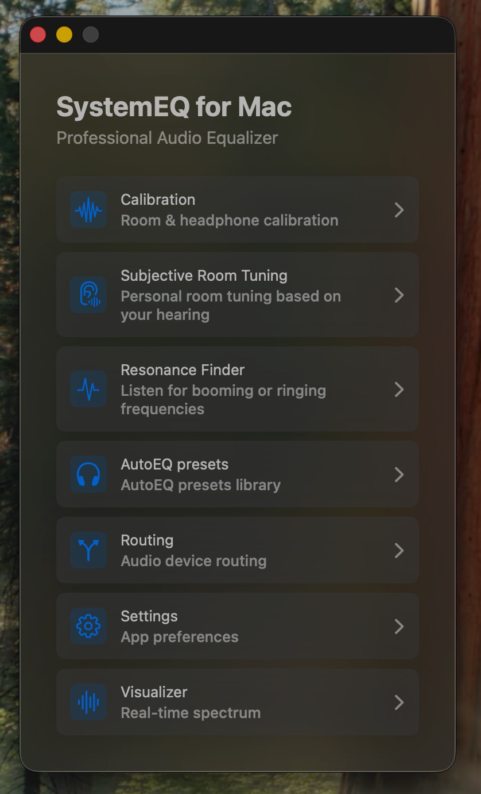
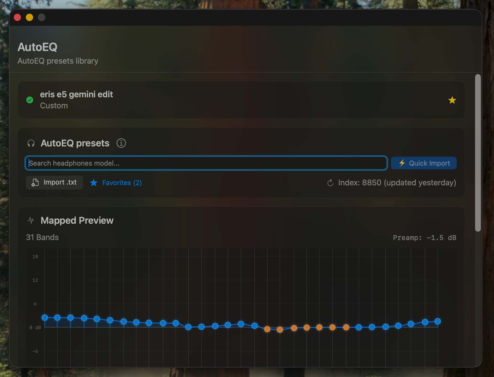
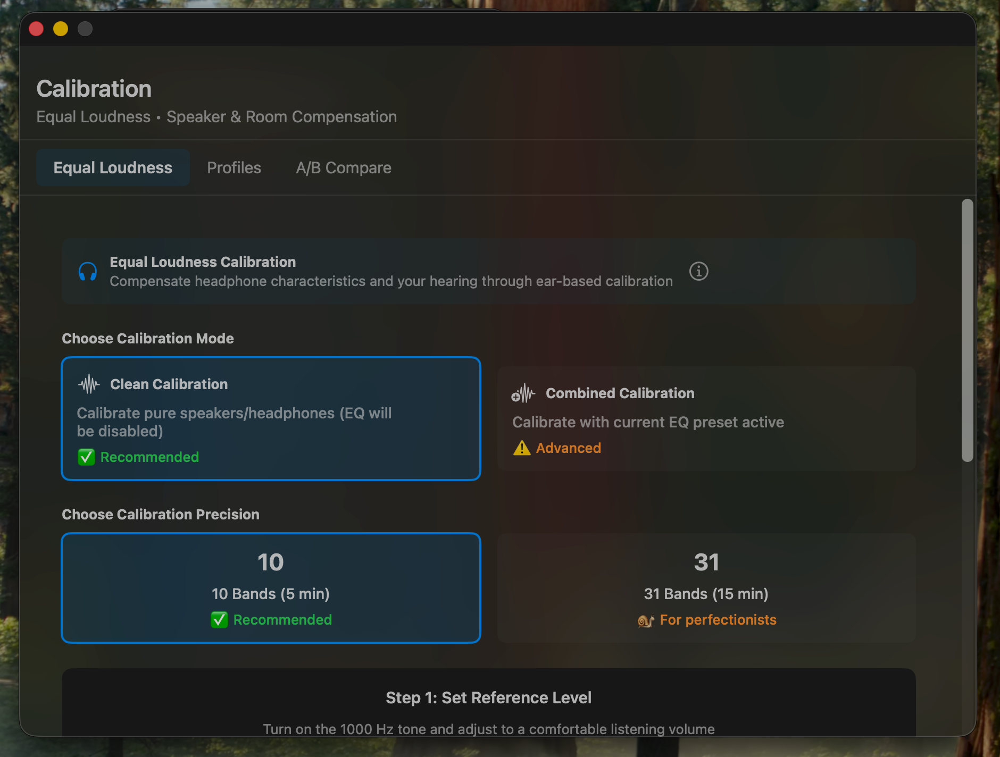
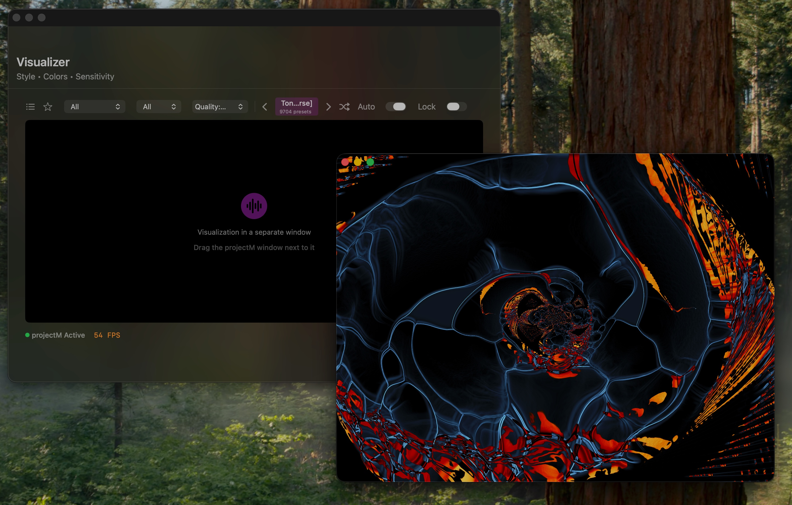
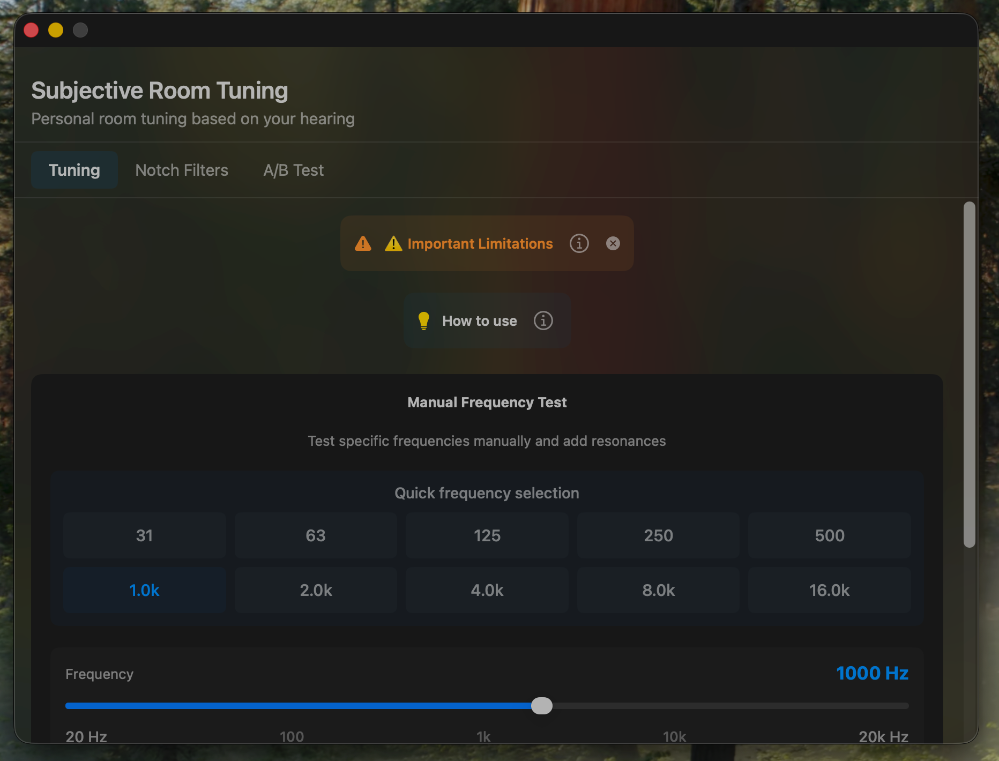
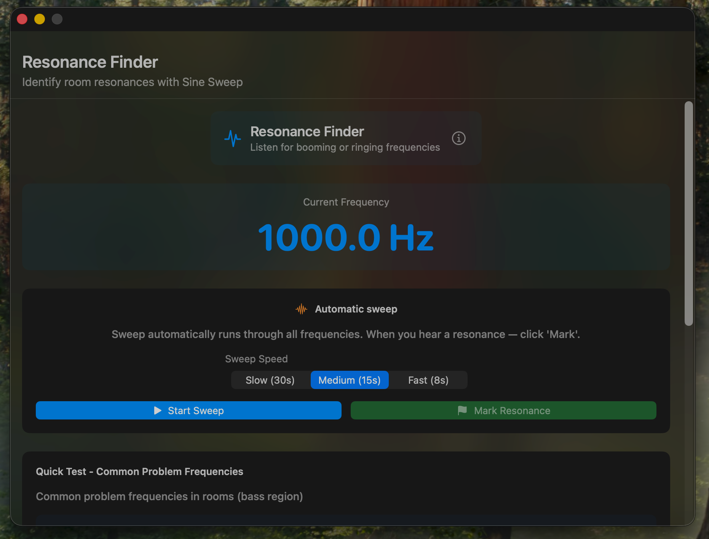
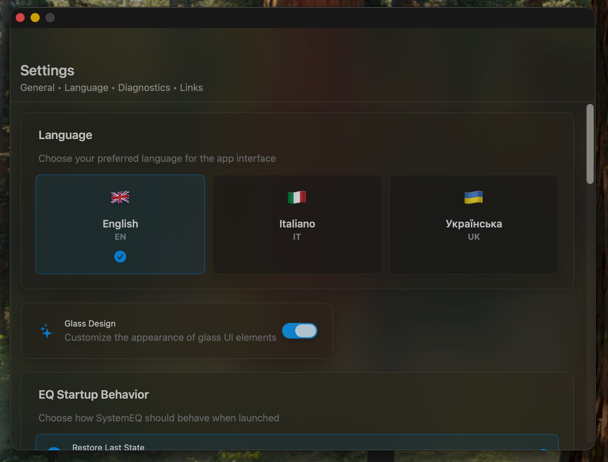

# SystemEQ for Mac

**Free, open-source system-wide parametric equalizer for macOS 13+**

Tune every sound on your Mac — Spotify, YouTube, Apple Music, anything.
10/31-band parametric EQ with an 8,665-headphone AutoEQ database, hearing
calibration, room-tuning tools, and a real-time visualizer. No subscriptions,
no telemetry.

[](https://www.apple.com/macos/)
[](https://swift.org)
[](LICENSE)
[](https://github.com/denzam/SystemEQ-for-Mac/releases/latest)
[](https://denzam.github.io/SystemEQ-for-Mac/)

> 🇬🇧 English | 🇺🇦 [Українська](README.ua.md) | 🇮🇹 [Italiano](README.it.md)



## 📸 Screenshots

| Main Menu | AutoEQ Database | Calibration | Visualizer |
| :---: | :---: | :---: | :---: |
| [](Docs/screenshots/01-main.jpeg) | [](Docs/screenshots/07-autoeq-library.png) | [](Docs/screenshots/02-calibration-mode.png) | [](Docs/screenshots/15-visualizer-active.jpeg) |

| Subjective Room Tuning | Resonance Finder | Device-Aware Presets |
| :---: | :---: | :---: |
| [](Docs/screenshots/04-room-tuning.png) | [](Docs/screenshots/05-resonance-sweep.png) | [](Docs/screenshots/10-settings-language.jpeg) |

## ✨ Features

### Core Features

- **10/31-band Parametric EQ** — Professional-grade audio processing with biquad filters
- **AutoEQ Database** — 8,665 headphone models, 8,850 presets (SQLite, 18 MB)
- **Real-time Visualization** — Spectrum, Waveform, Particles, Psychedelic
- **Calibration Module** — Hearing test + custom profiles + A/B comparison
- **Subjective Room Tuning** — Tune your room response by ear
- **Resonance Finder** — Sine sweep to identify boomy or ringing frequencies
- **Native System Audio Capture** — Process Tap on macOS 14.4+; BlackHole remains an automatic fallback
- **Preset Management** — Save, load, and organize your EQ settings
- **Auto-Switch Preset per Output** — Optionally re-apply the saved preset when you change physical output devices
- **Launch at Login** — Optional macOS login item
- **Menu Bar Mode** — Optionally hide the Dock icon while keeping the menu bar control
- **Multi-language** — English, Italian, Ukrainian

### Audio Engine

- **CoreAudioEngine** — Low-latency processing (~5-10ms) via AudioUnit (AUHAL)
- **vDSP Biquad Filters** — Accelerate framework, 5-10× faster than scalar
- **Peak Meters** — Real-time audio level monitoring
- **Clipping Protection** — Automatic gain reduction and preamp control
- **Media Key Support** — Volume control via keyboard shortcuts

### AutoEQ Integration

- **SQLite Database** — Instant offline search (<10ms)
- **4-tier Fallback** — Python server → Database → Local files → GitHub
- **ParametricEQ & GraphicEQ** — Full format support

## 🚀 Quick Start

### Requirements

- macOS 13.0 (Ventura) or later
- Apple Silicon or Intel Mac
- [BlackHole 2ch](https://github.com/ExistentialAudio/BlackHole) (optional fallback for macOS 13–14.3 or manual BlackHole mode)
- 4GB RAM (8GB recommended)

### Installation

#### ✅ Recommended: Homebrew — no manual Gatekeeper step

```bash
brew trust denzam/systemeq
brew install --cask denzam/systemeq/systemeq
```

The Cask removes the macOS quarantine attribute during installation, so the
app opens without the manual Gatekeeper confirmation required by the DMG.
The app remains ad-hoc signed and is not notarized.

> **Why `brew trust`?** Since Homebrew 6.0, third-party taps must be trusted
> explicitly before Homebrew will load them, and there is no way for a tap
> owner to grant that on your behalf. Without it you get
> `Refusing to load cask ... from untrusted tap`. It is a one-time command per
> machine. On Homebrew 5 and older, skip it — the command does not exist there.

#### Option 2: Download DMG or ZIP — manual Gatekeeper confirmation required

1. Download the latest `.dmg` or `.zip` from [Releases](https://github.com/denzam/SystemEQ-for-Mac/releases)
2. Open the DMG and drag `SystemEQ for Mac.app` to `/Applications`
3. **First launch (one of):**
   - **Right-click the app → Open → Open** in the confirmation dialog, or
   - Try to launch, then open **System Settings → Privacy & Security → Open Anyway**, or
   - From Terminal:
     ```bash
     xattr -dr com.apple.quarantine "/Applications/SystemEQ for Mac.app"
     ```
4. On macOS 14.4+, leave Audio Backend set to **Automatic**. Install BlackHole only if SystemEQ offers the fallback or you select BlackHole mode yourself.

> The app is **ad-hoc signed** (free, self-signed) — not notarized with an
> Apple Developer ID. Gatekeeper therefore shows a warning on first launch.
> This is intentional: SystemEQ stays free and does not require the paid
> Apple Developer Program. The Gatekeeper steps above are one-time only.

#### Option 3: Build from Source

```bash
git clone https://github.com/denzam/SystemEQ-for-Mac.git
cd "SystemEQ for Mac"
open "SystemEQ for Mac.xcodeproj"
# Press Cmd+R to build and run
```

### Setup Guide

1. **Use Automatic routing** (recommended on macOS 14.4+):
   - Open SystemEQ → Settings → Audio Backend
   - Leave it set to **Automatic**
   - Select your speakers or headphones in Routing, then click **Enable EQ**
   - SystemEQ captures audio natively; do not change the macOS system output

2. **Use BlackHole only when needed** (macOS 13–14.3, fallback, or manual selection):
   - Install [BlackHole 2ch](https://existential.audio/blackhole/) and restart SystemEQ
   - In Routing, select BlackHole as input and your speakers/headphones as output
   - Set **BlackHole 2ch** as the macOS System Output, then click **Enable EQ**

3. **Apply EQ Preset**:
   - AutoEQ tab → Search your headphone model
   - Click "⚡ Quick Import"
   - Or manually adjust bands in the Equalizer tab

## 🛠️ Architecture

```text
macOS 14.4+: System Audio → Process Tap → vDSP Biquad EQ → Physical Output

Fallback:     System Audio → BlackHole 2ch → vDSP Biquad EQ → Physical Output
```

**No Multi-Output Device is needed.** Automatic routing uses the native macOS engine when available; BlackHole is retained for compatibility and fallback.

### Technical Details

- **CoreAudioEngine**: Low-level AUHAL dual I/O, lock-free ring buffer
- **BiquadFilterVDSP**: vDSP batch processing, 5-10× faster than scalar
- **SPSCRingBuffer**: Lock-free SPSC buffer with C11 atomics
- **EQDatabase**: SQLite, 18 MB, 8,665 headphone models

## 📁 Project Structure

```text
SystemEQ for Mac/
├── Audio/              # Core Audio processing
│   ├── CoreAudioEngine.swift
│   ├── AudioRouter.swift
│   ├── BiquadFilterVDSP.swift
│   ├── CalibrationEngine.swift
│   └── SPSCRingBuffer.swift
├── Data/               # Data models and database
│   ├── EQDatabase.swift
│   ├── AutoEQModels.swift
│   └── PresetPersistence.swift
├── Features/           # UI views
│   ├── EqualizerView.swift
│   ├── AutoEQView.swift
│   ├── CalibrationView.swift
│   ├── VisualizerView.swift
│   └── RoutingView.swift
├── DesignSystem/       # Design tokens and components
├── Resources/          # Assets and database
│   └── EQDatabase.db
└── Docs/               # Documentation
```

## 🎯 Usage

### Equalizer

- Adjust frequency bands with sliders
- Switch between 10-band and 31-band modes
- Save custom presets for quick recall
- Apply auto-preamp to prevent clipping

### AutoEQ Presets

1. Search for your headphone model (8,665 available)
2. Choose a preset (oratory1990, Crinacle, etc.)
3. Click "⚡ Quick Import"
4. Adjust bass boost if needed

### Calibration

1. Run hearing test (31 frequencies)
2. Adjust volume per frequency to match reference
3. Save profile for automatic application
4. Use A/B comparison to test profiles

### Visualizer

- Choose from 4 styles: Spectrum, Waveform, Particles, Psychedelic
- Adjust intensity (0–100%)
- Real-time FFT at 60 FPS

### Room Tuning and Resonance Finder

- Use **Subjective Room Tuning** to tune your room response by ear
- Use **Resonance Finder** to sweep for boomy or ringing frequencies, then create a corrective notch filter

### Output-Specific Presets

In **Settings**, enable **Auto-Switch Preset per Output**. SystemEQ remembers
the preset applied on each physical output and re-applies it when you switch
outputs. You can also enable **Launch at Login** there.

## 🎚️ DAW Compatibility (Reaper, Logic, Ableton, etc.)

SystemEQ processes **system-wide audio output**. DAWs typically bypass the system output and talk directly to your audio interface — so EQ is **not applied** by default.

| Scenario | EQ applied? |
| --- | --- |
| Spotify, YouTube, Apple Music | ✅ Yes |
| DAW → System Output (manual config) | ✅ Yes |
| DAW → Audio Interface directly (typical) | ❌ No |
| DAW monitoring through Scarlett/Focusrite | ❌ No |

### How to use SystemEQ with your DAW

1. In your DAW, set **output device to BlackHole 2ch**
2. SystemEQ applies EQ and forwards audio to your physical output
3. To return to direct monitoring, set DAW output back to your interface

**Reaper:** Options → Preferences → Audio → Device → BlackHole 2ch

**Logic:** Preferences → Audio → Output Device → BlackHole 2ch

**Ableton:** Preferences → Audio → Output Device → BlackHole 2ch

> This adds ~10-20ms extra latency vs direct monitoring. This is an architectural limitation of routing through the BlackHole system driver.

## 📊 Project Status

SystemEQ ships its core EQ, routing, calibration, AutoEQ, output-specific preset, and visualizer features and is actively maintained.

## 🩺 Troubleshooting

### `Error: Refusing to load cask ... from untrusted tap`

Homebrew 6.0 will not load a third-party tap until you mark it as trusted, and a
tap owner cannot grant that for you. Run this once per Mac, then install or
upgrade as usual:

```bash
brew trust denzam/systemeq
brew upgrade --cask systemeq   # or: brew install --cask denzam/systemeq/systemeq
```

On Homebrew 5 and older the `trust` command does not exist — skip it.

### The app asks for microphone access again after an update

Expected. SystemEQ is ad-hoc signed, so its signature changes with every build
and macOS treats each update as a new app. Grant the permission again in
**System Settings → Privacy & Security → Microphone**.

### macOS says the app "cannot be opened"

The app is not notarized — see the Security Notice section below.
Right-click the app → **Open** → confirm, or run:

```bash
xattr -dr com.apple.quarantine "/Applications/SystemEQ for Mac.app"
```

Installing through Homebrew avoids this — the Cask clears the flag for you.

### No sound after setup

On macOS 14.4+, first choose **Automatic** in Settings → Audio Backend and enable EQ again. The system output should stay on your physical device. If Automatic falls back or cannot start, install BlackHole and follow the BlackHole setup below.

In **Routing**, select BlackHole as input and your speakers or headphones as
output. Set **BlackHole 2ch** as the macOS System Output, click **Enable EQ**,
and keep SystemEQ running.

### Sound is quieter after switching to BlackHole

macOS stores a separate volume level for each output device. After switching
to BlackHole, raise the system volume with the keyboard volume keys or in
macOS Sound settings.

## ⚠️ Security Notice

- This app is **not sandboxed** (incompatible with CoreAudio/AUHAL virtual audio devices)
- **No telemetry, analytics, or data collection** — all data stays on your Mac
- Only install from official [GitHub Releases](https://github.com/denzam/SystemEQ-for-Mac/releases)
- Ad-hoc signed — right-click → Open on first launch to bypass Gatekeeper

### Security audits

The codebase is audited periodically with automated security scanning. Findings
and their resolution are tracked in [SECURITY.md](SECURITY.md); fixes ship in the
next release and are listed in [CHANGELOG.md](CHANGELOG.md).

Found something? See [SECURITY.md](SECURITY.md) for how to report it.

## 🤝 Contributing

1. Fork the project
2. Enable the pre-commit hook once per clone:
   ```bash
   git config core.hooksPath .githooks
   ```
   It formats staged Swift files and runs the same SwiftFormat and SwiftLint
   gates as CI, so a push does not fail on something catchable locally.
3. Create your feature branch (`git checkout -b feature/AmazingFeature`)
4. Commit your changes (`git commit -m 'Add AmazingFeature'`)
5. Push to the branch (`git push origin feature/AmazingFeature`)
6. Open a Pull Request

## 📄 License

**GNU General Public License v3.0** — see [LICENSE](LICENSE).

SystemEQ is free software. You may use, modify, and redistribute it, but
any redistributed version (including forks and derivative works) must
also be released under GPLv3 with full source code available. Closed-source
forks are not permitted; commercial distribution remains subject to GPLv3's
source-code and license obligations.

Third-party components and their licenses are listed in
[THIRDPARTY.md](THIRDPARTY.md).

## 🙏 Credits

- [AutoEQ](https://github.com/jaakkopasanen/AutoEq) by Jaakko Pasanen — EQ preset database
- [BlackHole](https://github.com/ExistentialAudio/BlackHole) by Existential Audio — Virtual audio driver
- [oratory1990](https://www.reddit.com/r/oratory1990/) — Headphone measurements and research

Also thanks to **Michel**, **Renato**, **David** and **Alberto** for their support and advice along the way.

## 💖 Support Development

- 🍺 [Buy Me a Coffee](https://buymeacoffee.com/denzam)
- 💝 [GitHub Sponsors](https://github.com/sponsors/denzam)

## 📧 Contact

- **GitHub**: [@denzam](https://github.com/denzam)
- **Issues / Questions**: [GitHub Issues](https://github.com/denzam/SystemEQ-for-Mac/issues)

---

**Made with ❤️ for the audio community**
